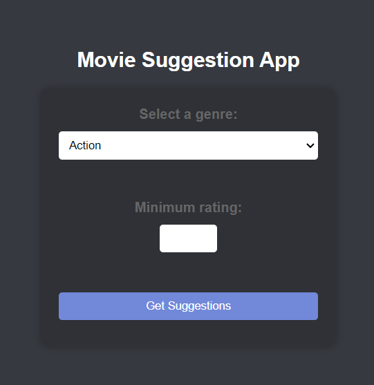
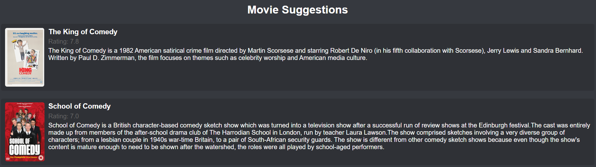

# Movie Suggestion App

The Movie Suggestion App is a Flask-based web application that allows users to get movie suggestions based on their genre preference and minimum rating. It integrates with the IMDb and Wikipedia APIs to fetch movie data and summaries.

## Getting Started

### Prerequisites

- Python 3.x
- Flask

### Installation

1. Clone the repository:

```
   git clone https://github.com/your-username/movie-suggestion-app.git
```

Install the required dependencies:

```
pip install -r requirements.txt
```

### Usage

Run the Flask application:

```
python app.py
```

Access the application in your web browser at http://localhost:5000.

Select a genre and minimum rating for the movie suggestions, then click "Get Suggestions".

The application will fetch movie data from IMDb and display the suggestions along with their ratings and summaries.

### Customization
To add or modify genres, update the <option> tags in the index.html file.

Styling and layout can be customized by modifying the CSS files in the static directory.

The Flask routes and API integrations can be modified in the app.py file.

### Contributing
Contributions to the Movie Suggestion App are welcome! If you encounter any issues or have suggestions for improvements, please create a new issue or submit a pull request.

### Demonstration
The start page



The search includes 'Comedy' and rating '5'


The results



### License
This project is licensed under the MIT License.

Feel free to customize and expand upon this README file to include any additional information or instructions specific to your project.